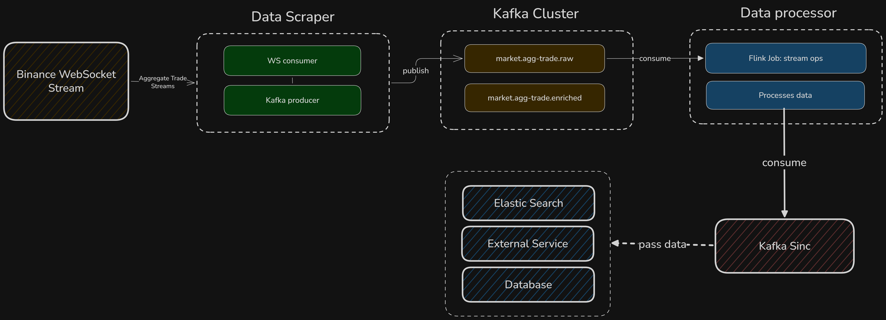
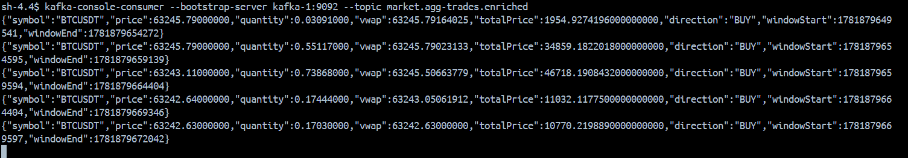

<div align="center">
<h1>Market data pipeline DEMO</h1>



<p>Real-time market analysis platform using Binance WebSocket Stream</p>
</div>

---

## Overview

The application consists of three main components:
 - **Data Ingestion**: fetches real-time market data from Binance API and publishes it to Apache Kafka topics.
 - **Data processor**: consumes data from Kafka, processes it using Apache Flink, and publishes the processed data to another Kafka topic.
 - **Consumers**: it can be a dashboard, alerting system, Elasticsearch, etc. They consume the processed data.

### Data Ingestion ( `Data-scraper` )

> This component is responsible for fetching real-time market data from Binance API.

It has one interface: `Scraper` with only one method: `scrape()`.
For demonstration, I have created one implementation: `AggTradeScraper`. It fetches aggregated trade data for a specific symbol (e.g., BTCUSDT) and publishes it to a Kafka topic.
*Note: You can create your own implementation of `Scraper` interface. For example, to fetch candlestick data, you can use `CandlestickScraper`.*

You can find more information about **Binance WebSocket Streams** in the [official documentation](https://developers.binance.com/docs/binance-spot-api-docs/web-socket-streams).

This is the code fragment of `AggTradeScraper` class, which implements the `Scraper` interface.
It uses the `webSocketClient` to connect to the Binance WebSocket API and subscribes to the `aggTrade` stream for the specified symbol.
After receiving the data, it maps it to an `AggTradeEvent` object and sends it to the `kafkaProducerService` for publishing to the Kafka topic.
```java
@Override
    public void scrape() {
        log.info("Started scraping: AggTrade, symbol: BTCUSDT");
        webSocketClient.execute(
                URI.create(uri),
                session ->
                        session.receive()
                                .map(WebSocketMessage::getPayloadAsText)
                                //.log()
                                .map(AggTradeMapper::map)
                                .flatMap(kafkaProducerService::sendRawTradeEvent)
                                .doOnError(error -> error.printStackTrace())
                                .then()
        ).subscribe();
    }
```

### Data processor ( `Data-processor` )
> This component is responsible for processing the data from Kafka and publishing it to another Kafka topic.

It uses **Apache Flink** to process the data. The `FlinkJob` class is the main entry point for the Flink job. It consumes data from the Kafka topic, processes it, and publishes the processed data to another Kafka topic.
Just for demonstration, I have created one Apache Flink job: `AggTradeStreamJob`. It processes the aggregated trade data and calculates **VWAP** (Volume Weighted Average Price) (e.g., BTCUSDT) over a time window. *(5 seconds)*

**Why Apache Flink?** 
1. It's a streaming data processing engine. It can process data in real-time and process it efficiently.
2. The application can be extended to process other types of data, such as candlestick data, or other types of data. 
3. It can be used to implement complex event processing (CEP) and anomaly detection. It can also be used for data analytics and machine learning.

### Consumers
> These components consume the processed data.

After the data is processed, it can be consumed from Apache Kafka topics. *(`market.agg-trades.enriched` in my case)* However, you can configure the output stream to any other topic or service (Elasticsearch, WebSocket, etc.). 
The processed data can be used to detect anomalies, perform analytics, or perform other tasks.

### Module Architecture

In this project I use two common modules: `common-kafka` and `common-events`. They are used to share common classes and interfaces between the modules.
Without a centralized approach, each service would implement its own serialization logic, leading to:
 - Code duplication
 - Inconsistency in data formats
 - Inability to reuse code

---
## Input and Output Data  Structure

In the package `com.socompany.commonevents.raw` you can find the raw data structure. It represents the data received from the Binance WebSocket API.
In the package `com.socompany.commonevents.enriched` you can find the enriched data structure. It represents the processed data.

Example of enriched data:
```java
public record EnrichedTrade (
        String symbol,
        BigDecimal price,
        BigDecimal quantity,
        BigDecimal vwap,                    // volume-weighted average price over a window
        BigDecimal totalPrice,              // sum of quantity in a window
        TradeDirection direction,           // BUY or SELL
        long windowStart,
        long windowEnd
) {}
```

*Note: In case you want to add new data scrapers or processors, you can add new data structures in that module. You are also free to use an existing data structure.🔝*

## Installation
*Make sure you have installed Docker and Docker Compose. It also requires Java 25 with Gradle (Kotlin) support.*
1. Clone the repository: `git clone https://github.com/sasha-sh/reactive-market-pipeline.git`
2. Navigate to the project directory: `cd reactive-market-pipeline`
3. Run the docker-compose file to run Apache Kafka: `docker-compose -f utils/docker-compose.yaml up -d`. It will also create the necessary topics for you.
4. Install all required dependencies for each module: `./gradlew build -x test`
5. Run the `Data-scraper` module, so it can start fetching data from Binance WebSocket stream and publishing it to Kafka topic.
6. Run the `Data-processor` module, wait 5 seconds, and you can see the processed data in the `market.agg-trades.enriched` topic.

Verify: 
 - Local (Inside container): `kafka-console-consumer --bootstrap-server localhost:29092 --topic market.agg-trades.enriched`
 - On your local machine: `kafka-console-consumer --bootstrap-server localhost:29092 --topic market.agg-trades.enriched`

Example output (`market.agg-trades.enriched` topic):
<div align="center">

</div>

## Contributing
Pull requests are welcome. For major changes, please open an issue first to discuss what you would like to change.
You can implement/enhance the existing features or add new ones (new processors, new consumers, etc.).
You can reach me at [LinkedIn](https://www.linkedin.com/in/aleksander-slabunov-937238281/) or Discord: `sash.ik`
---
This application is published under MIT License. This project is a demo and is not intended for production use.
You can use it for educational purposes.
## Thank you for your attention! 💖